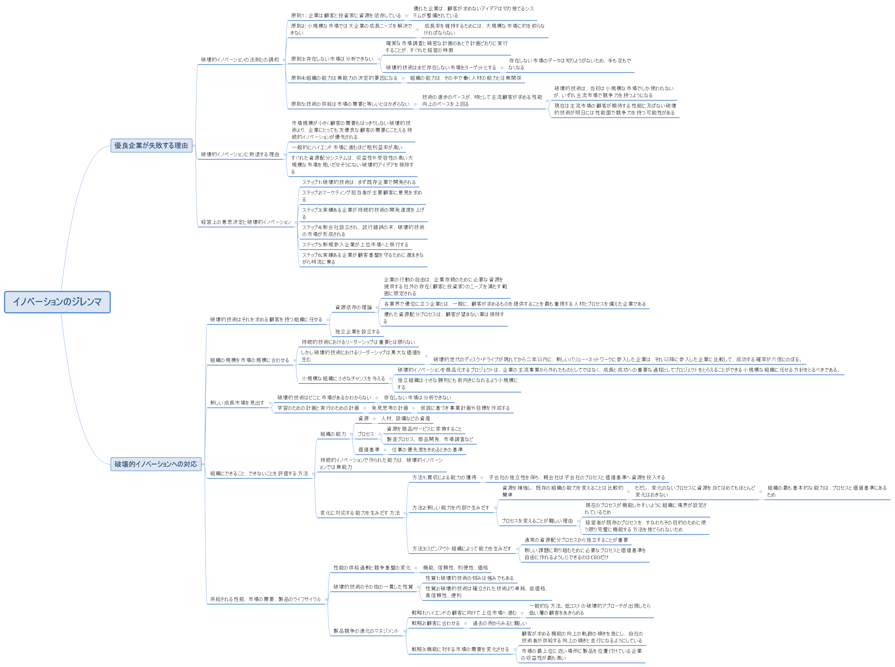

# イノベーションのジレンマ

## 概要マインドマップ

## イノベーションのジレンマ図

- 破壊的技術は、当初は主要市場(ハイエンド市場)の顧客が求める性能に達していない
- そのため、破壊的技術が強みとなる新しい市場(ローエンド市場)を発掘する
- 破壊的技術の進化で主要市場(ハイエンド市場)の顧客が求める性能水準を上回ることで、破壊的技術が主要市場へ進出する
- 破壊的技術は、一般的に低価格でシンプルである
