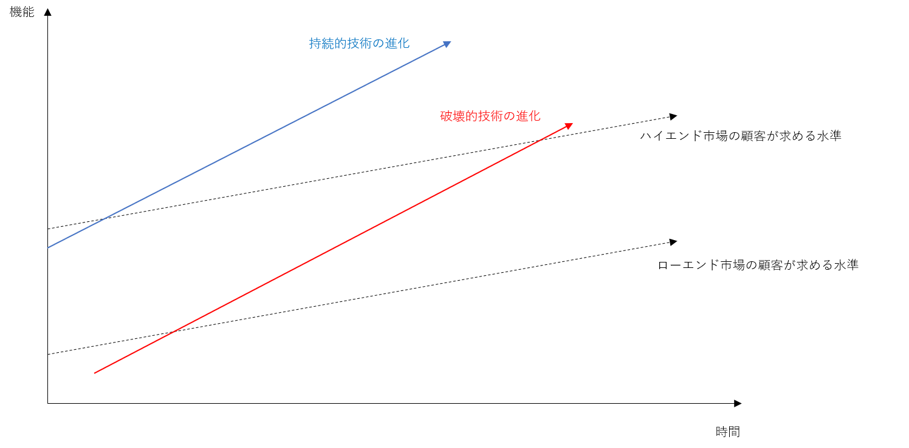

# 「イノベーションのジレンマ」要約

[イノベーションのジレンマ](https://www.amazon.co.jp/%E3%82%A4%E3%83%8E%E3%83%99%E3%83%BC%E3%82%B7%E3%83%A7%E3%83%B3%E3%81%AE%E3%82%B8%E3%83%AC%E3%83%B3%E3%83%9E-%E2%80%95%E6%8A%80%E8%A1%93%E9%9D%A9%E6%96%B0%E3%81%8C%E5%B7%A8%E5%A4%A7%E4%BC%81%E6%A5%AD%E3%82%92%E6%BB%85%E3%81%BC%E3%81%99%E3%81%A8%E3%81%8D-Harvard-business-school/dp/4798100234)の要約です。  

優良な企業ほど破壊的イノベーションに敗退する理由について、ディスクドライブ市場などの事例をもとに解説されています。  
破壊的イノベーションの特性や、破壊的イノベーションと調和しマネジメントする方法が根拠を示しながら説明されています。

経営者はもちろんですが、破壊的イノベーションとなりうる製品の開発を任されるチームリーダーや開発者もこの内容を知っておくことで、破壊的イノベーションが成功する可能性をあげられると思います。

## 優良企業が失敗する理由

### 破壊的イノベーションの法則との調和
- 原則１：企業は顧客と投資家に資源を依存している
  - 優れた企業は、顧客が求めないアイデアは切り捨てるシステムが整備されている
- 原則2：小規模な市場では大企業の成長ニーズを解決できない
  - 成長率を維持するためには、大規模な市場に的を絞らなければならない
- 原則3:存在しない市場は分析できない
  - 確実な市場調査と綿密な計画のあとで計画どおりに実行することが、すぐれた経営の特徴
  - 破壊的技術はまだ存在しない市場をターゲットとする
    - 存在しない市場のデータは知りようがないため、手も足もでなくなる
- 原則4:組織の能力は無能力の決定的要因になる
  - 組織の能力は、その中で働く人材の能力とは無関係
- 原則5:技術の供給は市場の需要と等しいとはかぎらない
  - 技術の進歩のペースが、時として主流顧客が求める性能向上のペースを上回る
    - 破壊的技術は、当初は小規模な市場でしか使われないが、いずれ主流市場で競争力を持つようになる
    - 現在は主流市場の顧客が期待する性能に及ばない破壊的技術が明日には性能面で競争力を持つ可能性がある

### 破壊的イノベーションに敗退する理由
- 市場規模が小さく顧客の需要もはっきりしない破壊的技術より、企業にとっても友優良な顧客の需要にこたえる持続的イノベーションが優先される
- 一般的にハイエンド市場に進むほど粗利益率が高い
- すぐれた資源配分システムは、収益性や受容性の高い大規模な市場を見いだせそうにない破壊的アイデアを排除する

### 経営上の意思決定と破壊的イノベーション  
  破壊的イノベーションは以下の流れとなることが多い。
- ステップ1:破壊的技術は、まず既存企業で開発される
- ステップ2:マーケティング担当者が主要顧客に意見を求める
- ステップ3:実績ある企業が持続的技術の開発速度を上げる
- ステップ4:新会社設立され、試行錯誤の末、破壊的技術の市場が形成される
- ステップ5:新規参入企業が上位市場へと移行する
- ステップ6:実績ある企業が顧客基盤を守るために遅まきながら時流に乗る

### 持続的イノベーションと破壊的イノベーションの関係  

- 破壊的技術は、当初は主要市場(ハイエンド市場)の顧客が求める性能に達していない
- そのため、破壊的技術が強みとなる新しい市場(ローエンド市場)を発掘する
- 破壊的技術の進化で主要市場(ハイエンド市場)の顧客が求める性能水準を上回ることで、破壊的技術が主要市場へ進出する
- 破壊的技術は、一般的に低価格でシンプルである

## 破壊的イノベーションへの対応

### 破壊的技術はそれを求める顧客を持つ組織に任せる
- 資源依存の理論
  - 企業の行動の自由は、企業存続のために必要な資源を提供する社外の存在（顧客と投資家）のニーズを満たす範囲に限定される
  - 各業界で優位に立つ企業とは、一般に、顧客が求めるものを提供することを最も重視する人材とプロセスを備えた企業である
  - 優れた資源配分プロセスは、顧客が望まない案は排除する
- 独立企業を設立する
### 組織の規模を市場の規模に合わせる
- 持続的技術におけるリーダーシップは重要とは限らない
- しかし破壊的技術におけるリーダーシップは莫大な価値を生む
  - 破壊的世代のディスク・ドライブが現れてから二年以内に、新しいバリュー・ネットワークに参入した企業は、それ以降に参入した企業に比較して、成功する確率が六倍にのぼる。
- 小規模な組織に小さなチャンスを与える
  - 破壊的イノベーションを商品化するプロジェクトは、企業の主流事業から外れたものとしてではなく、成長と成功への重要な過程としてプロジェクトをとらえることができる小規模な組織に任せる方針をとるべきである。
  - 独立組織は小さな勝利にも前向きになれるよう小規模にする
### 新しい成長市場を見出す
- 破壊的技術はどこに市場があるかわからない
  - 存在しない市場は分析できない
- 学習のための計画と実行のための計画
  - 発見思考の計画
    - 仮説に基づき事業計画や目標を作成する
### 組織にできること、できないことを評価する方法
- 組織の能力
  - 資源
    - 人材、設備などの資産
  - プロセス
    - 資源を商品/サービスに変換すること
    - 製造プロセス、商品開発、市場調査など
  - 価値基準
    - 仕事の優先度をきめるときの基準
- 持続的イノベーションで作られた能力は、破壊的イノベーションでは無能力
- 変化に対応する能力を生みだす方法
  - 方法1:買収による能力の獲得
    - 子会社の独立性を保ち、親会社は子会社のプロセスと価値基準へ資源を投入する
  - 方法2:新しい能力を内部で生みだす
    - 資源を補強し、既存の組織の能力を変えることは比較的簡単
      - ただし、変化のないプロセスに資源を当てはめてもほとんど変化はおきない
        - 組織の最も基本的な能力は、プロセスと価値基準にあるため
    - プロセスを変えることが難しい理由
      - 現在のプロセスが機能しやすいように組織に境界が設定されているため
      - 経営者が既存のプロセスを、すなわちその目的のために使う限り完璧に機能する方法を捨てられないため
  - 方法3:スピンアウト組織によって能力を生みだす
    - 通常の資源配分プロセスから独立することが重要
    - 新しい課題に取り組むために必要なプロセスと価値基準を自由に作れるようしじできるのはCEOだけ
### 供給される性能、市場の需要、製品のライフサイクル
- 性能の供給過剰と競争基盤の変化
  - 機能、信頼性、利便性、価格
- 破壊的技術のその他の一貫した性質
  - 性質1:破壊的技術の弱みは強みでもある
  - 性質2:破壊的技術は確立された技術より単純、低価格、高信頼性、便利
- 製品競争の進化のマネジメント
  - 戦略1:ハイエンドの顧客に向けて上位市場へ進む
    - 一般的な方法。低コストの破壊的アプローチが出現したら低い層の顧客をあきらめる
  - 戦略2:顧客に合わせる
    - 過去の例からみると難しい
  - 戦略3:機能に対する市場の需要を変化させる
    - 顧客が求める機能の向上の軌跡の傾きを急にし、自社の技術者が供給する向上の傾きと並行になるようにしている
    - 市場の最上位に近い場所に製品を位置付けている企業の収益性が最も高い